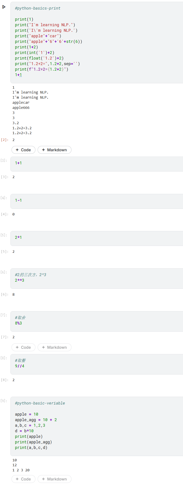

# Python 基础语法速查 (Day1 - Part1)

> **记录时间**：2026-04-23
> **内容范围**：print函数、字符串基础、数学运算符、类型转换、格式化输出  

---

## 代码概览

---

## 1. print 函数与字符串基础

| 知识点 | 正确示例 | 错误示例 | 说明 |
|:---|:---|:---|:---|
| **引号嵌套** | `print("I'm NLP")` | `print('I'm NLP')` | 双引号内可直接用单引号 |
| **转义字符** | `print('I\'m NLP')` | — | `\` 用于转义特殊字符 |
| **多参数空格** | `print("a", 1, sep='')` | — | `sep` 控制分隔符，默认为空格 `' '` |

---

## 2. 字符串拼接与类型转换

| 知识点 | 正确示例 | 错误示例 | 说明 |
|:---|:---|:---|:---|
| **字符串拼接** | `"apple" + "car"` | `"apple" + 4` | `+` 只能拼接字符串 |
| **数字转字符串** | `"apple" + str(4)` | — | 用 `str()` 函数转换 |
| **字符串转整数** | `int('1') + 2` | `int('1.2')` | `int()` 只能转换纯整数字符串 |
| **字符串转浮点数** | `float('1.2') + 2` | — | 带小数点的字符串用 `float()` |

---

## 3. 格式化输出

| 方式 | 代码示例 | 输出结果 | 特点 |
|:---|:---|:---|:---|
| **f-string** | `print(f"1.2+2={1.2+2}")` | `1.2+2=3.2` | **推荐**，直观且无多余空格 |
| **逗号分隔** | `print("1.2+2=", 1.2+2)` | `1.2+2= 3.2` | 参数间默认加空格，可用 `sep=''` 去除 |
| **传统拼接** | `print("1.2+2=" + str(1.2+2))` | `1.2+2=3.2` | 需手动转换类型，较繁琐 |

---

## 4. 数学运算符

| 运算符 | 含义 | 示例 | 结果 |
|:---|:---|:---|:---|
| `+` | 加法 | `1 + 2` | `3` |
| `-` | 减法 | `1 - 1` | `0` |
| `*` | 乘法 | `2 * 1` | `2` |
| `/` | 除法 | `3 / 2` | `1.5` |
| `**` | 幂运算 | `2 ** 3` | `8` |
| `%` | 取模（求余） | `8 % 3` | `2` |
| `//` | 整除（地板除） | `8 // 3` | `2` |

---

## 5. 变量 (Variables)

| 知识点 | 代码示例 | 说明 |
|---|---|---|
| **变量赋值** | `apple = 10` | 将右边的值存入左边的变量 |
| **表达式计算后赋值** | `apple_agg = 10 + 2` | 先计算右边表达式，再将结果赋给变量 |
| **多重赋值** | `a, b, c = 1, 2, 3` | 一行同时给多个变量赋值 |
| **使用变量进行计算** | `d = b * 10` | 变量可以像数值一样参与运算 |
| **打印多个变量** | `print(a, b, c, d)` | 用逗号分隔，同时输出多个变量的值 |

### 变量命名规则

| 规则 | 正确示例 | 错误示例 | 说明 |
|---|---|---|---|
| 只能包含字母、数字、下划线 | `user_name`, `apple2` | `user-name`, `apple@` | 不能用短横线或特殊符号 |
| 不能以数字开头 | `name1`, `_valid` | `1name`, `2apple` | 数字开头会导致语法错误 |
| 区分大小写 | `Apple` 和 `apple` 是不同的变量 | — | Python 严格区分大小写 |
| 不能使用 Python 关键字 | `my_class`, `for_loop` | `class`, `for` | 关键字是 Python 保留的特殊词汇 |

---

## 6. Kaggle Notebook 使用小技巧

| 发现 | 说明 |
|---|---|
| 一个单元格只显示最后一行表达式的值 | 如需显示多个结果，请使用 print() 包裹 |
| [数字] 是执行计数器 | 表示该单元格是第几个运行的，不影响代码逻辑 |
| 代码单元格可按 Shift + Enter 运行 | 运行后自动插入新单元格 |