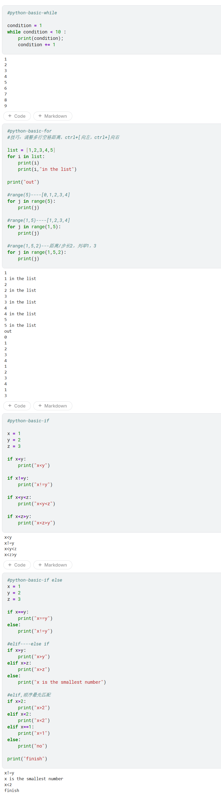

# Python 基础语法速查 (Day1 - Part2)

> **记录时间**：2026-04-23
> **内容范围**：while,for,if,else,elif

---

## 代码概览

---

## 1. while 循环

| 知识点 | 代码示例 | 说明 |
|---|---|---|
| **while 基本语法** | `while condition < 10:` | 当条件为 True 时，重复执行循环体内的代码 |
| **循环变量更新** | `condition += 1` | 必须在循环体内更新条件变量，否则会陷入无限循环 |
| **缩进规则** | 循环体内的代码必须缩进（通常 4 个空格） | Python 通过缩进来识别代码块 |
| **注意** | `while` 语句后必须有冒号 `:` | 缺少冒号会导致语法错误 |

---

## 2. for 循环

| 知识点 | 代码示例 | 说明 |
|---|---|---|
| **遍历列表** | `for i in list:` | 依次取出列表中的每个元素赋值给变量 `i` |
| **range(5)** | `for j in range(5):` | 生成 0, 1, 2, 3, 4 的整数序列 |
| **range(1, 5)** | `for j in range(1, 5):` | 生成 1, 2, 3, 4（左闭右开，不包含 5） |
| **range(1, 5, 2)** | `for j in range(1, 5, 2):` | 第三个参数是步长，生成 1, 3 |

---

## 3. if 条件判断

| 知识点 | 代码示例 | 说明 |
|---|---|---|
| **基本 if 语句** | `if x < y:` | 条件为 True 时执行缩进的代码块 |
| **不等于判断** | `if x != y:` | `!=` 表示不等于 |
| **多重条件** | `if x < y < z:` | Python 支持链式比较，等价于 `x < y and y < z` |
| **复合条件** | `if x < z > y:` | 表示 `x < z` 且 `z > y` |
| **注意** | 每个条件语句后必须有冒号 `:` | — |

---

## 4. if-elif-else 多分支判断

| 知识点 | 代码示例 | 说明 |
|---|---|---|
| **if-else** | `if x > y: ... else: ...` | 二选一分支，条件为 True 执行 if 块，否则执行 else 块 |
| **elif** | `elif x > z:` | `else if` 的缩写，用于多个条件的依次判断 |
| **多分支结构** | `if ... elif ... else` | 从上到下依次检查条件，一旦满足就执行对应代码块并跳出 |
| **else 兜底** | `else:` | 当所有 if/elif 条件都不满足时执行 |
| **注意** | `elif` 和 `else` 必须跟在 `if` 后面，不能单独使用 | — |

---

## 5. 循环与条件判断综合收获

- `while` 适用于**不知道具体循环次数**的场景，依靠条件判断控制循环结束。
- `for` 适用于**已知循环次数**或**遍历序列**（列表、range 等）的场景。
- `if-elif-else` 是多分支判断的标准结构，条件按顺序检查，只执行第一个满足的分支。
- Python 通过**缩进**来识别代码块，缩进不一致会导致语法错误。
- 冒号 `:` 是 Python 语句块的固定前缀，条件、循环、函数定义后都必须加冒号。