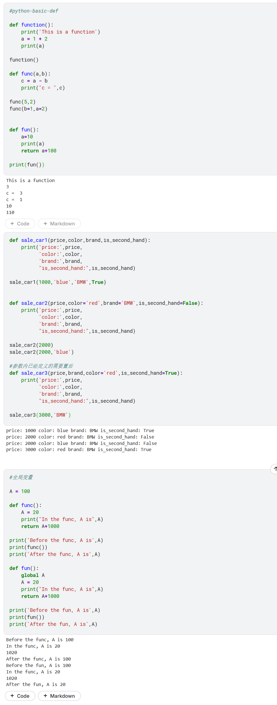

# Python 基础语法速查 (Day1 - Part3)

> **记录时间**：2026-04-23
> **内容范围**：def，函数，参数，全局变量

---

## 代码概览

---

## 1. 函数定义与调用

| 知识点 | 代码示例 | 说明 |
|---|---|---|
| **定义函数** | `def function():` | `def` 关键字开头，后接函数名和括号，以冒号结尾 |
| **函数体** | 缩进的代码块 | 函数内部的代码必须缩进 |
| **调用函数** | `function()` | 函数名加括号即可执行函数体 |
| **无参数函数** | `def func(): ...` | 括号内为空，调用时不需要传参 |

---

## 2. 函数参数

| 知识点 | 代码示例 | 说明 |
|---|---|---|
| **位置参数** | `def func(a, b):` | 调用时按顺序传入参数 |
| **关键字参数** | `func(b=1, a=2)` | 调用时指定参数名，可以不按顺序 |
| **默认参数** | `def func(color='red'):` | 定义时给参数赋默认值，调用时可省略该参数 |
| **默认参数位置规则** | 默认参数必须放在非默认参数后面 | 例如 `def func(price, color='red')` 正确，`def func(color='red', price)` 错误 |

---

## 3. 函数返回值

| 知识点 | 代码示例 | 说明 |
|---|---|---|
| **return 语句** | `return a + 100` | 将计算结果返回给调用者 |
| **无 return 语句** | 函数默认返回 `None` | 只执行操作，不返回具体值 |
| **调用带返回值的函数** | `print(fun())` | 可以直接在表达式中使用返回值 |

---

## 4. 全局变量与局部变量

| 知识点 | 代码示例 | 说明 |
|---|---|---|
| **局部变量** | 函数内部定义的变量 | 只在函数内部有效，外部无法访问 |
| **全局变量** | 函数外部定义的变量 | 整个程序都可访问，但函数内默认不能修改 |
| **global 关键字** | `global A` | 在函数内声明变量为全局变量，可以修改其值 |
| **变量遮蔽** | 函数内定义同名局部变量时，优先使用局部变量 | 不会影响全局变量的值（除非使用 `global`） |

---

## 函数学习收获

- `def` 是 Python 定义函数的关键字，函数名后必须加冒号，函数体需要缩进。
- 参数让函数更灵活：位置参数按顺序传入，关键字参数可以指定参数名，默认参数让调用更简洁。
- `return` 用于返回计算结果，没有 `return` 时函数默认返回 `None`。
- 全局变量和局部变量的作用域不同：函数内部默认只能读取全局变量，要修改必须用 `global` 声明。
- 默认参数必须放在非默认参数的**后面**，否则会报语法错误。