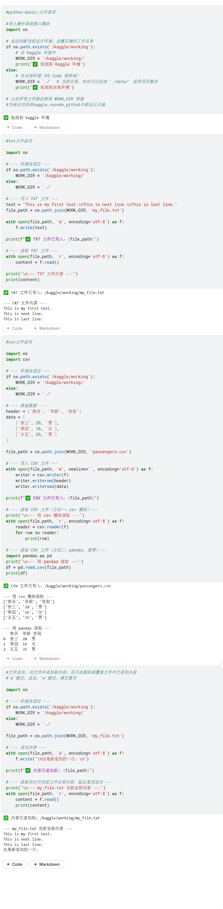

# Python 基础语法速查 (Day1 - Part4)

> **记录时间**：2026-04-23
> **内容范围**：文件读写

---

## 代码概览



---

## TXT 文件读写

| 操作 | 代码示例 | 说明 |
|---|---|---|
| **写入 TXT** | `with open(path, 'w', encoding='utf-8') as f: f.write(text)` | `'w'` 模式会清空原内容后写入 |
| **读取 TXT** | `with open(path, 'r', encoding='utf-8') as f: content = f.read()` | `'r'` 模式读取全部内容 |
| **编码参数** | `encoding='utf-8'` | 避免中文乱码 |

---

## CSV 文件读写

| 操作 | 代码示例 | 说明 |
|---|---|---|
| **写入 CSV** | `writer = csv.writer(f)`<br>`writer.writerow(header)`<br>`writer.writerows(data)` | 需要 `import csv`，自动处理逗号、引号等格式 |
| **读取 CSV (csv模块)** | `reader = csv.reader(f)`<br>`for row in reader: print(row)` | 逐行读取，每行是一个列表 |
| **读取 CSV (pandas)** | `df = pd.read_csv(path)` | 推荐，直接返回表格，显示更直观 |

---

## 文件打开模式速查

| 模式 | 全称 | 行为 | 使用场景 |
|---|---|---|---|
| `'r'` | Read | 只读，文件必须存在 | 读取已有文件 |
| `'w'` | Write | 清空后写入，不存在则创建 | 创建新文件或完全覆盖 |
| `'a'` | Append | 追加到末尾，不存在则创建 | 写日志、累积数据 |
| `'r+'` | Read/Write | 读写，文件必须存在 | 修改已有文件内容 |

---

## 文件追加示例

```python
with open(file_path, 'a', encoding='utf-8') as f:
    f.write("\n这是追加的一行。")
```

### 注意事项

| 事项 | 说明 |
|---|---|
| **换行问题** | 原文末尾无 `\n` 时，追加内容应加 `\n` 前缀，确保另起一行 |
| **验证追加** | 追加后立即用 `'r'` 模式读取并打印，确认操作成功 |

---

## 文件读写收获

- `import os` 用于环境判断和路径拼接，是跨平台运行的关键。
- `import csv` 专门处理 CSV 格式，自动解决分隔符、引号等复杂问题。
- `'w'` 模式是“推倒重来”，`'a'` 模式是“只增不减”。
- Kaggle 文件写入必须使用 `/kaggle/working/` 目录，本地则相对灵活。
- 读写文件时统一加 `encoding='utf-8'`，避免中文乱码。

---
