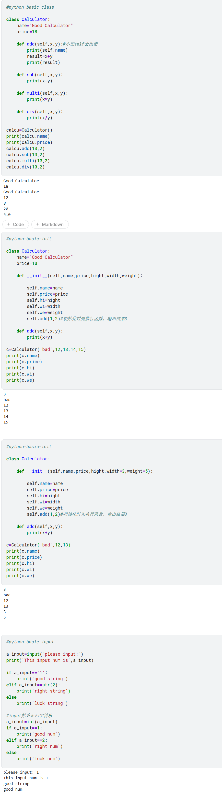

# Python 基础语法速查 (Day1 - Part5)

> **记录时间**：2026-04-23
> **内容范围**：class,input

---

## 代码概览

---

## 类的定义与实例化

| 知识点 | 说明 |
|---|---|
| `class ClassName:` | 定义类的关键字，类名通常采用大驼峰命名 |
| `def method(self, ...):` | 类内部定义方法，第一个参数必须是 `self` |
| `self.name` | 访问实例自身的属性或方法 |
| `calcu = Calculator()` | 创建类的实例（对象） |

---

## `__init__`构造方法

| 知识点 | 说明 |
|---|---|
| `__init__` 写法 | 前后各两个下划线，共四个下划线 |
| 调用时机 | 创建实例时自动执行，用于初始化属性 |
| 内部可调用其他方法 | 如 `self.add(1, 2)` 在初始化时立即执行 |
| 常见错误 | 只写一个下划线 `_init_`，导致 Python 不识别为构造方法 |

---

## 默认参数

| 知识点 | 说明 |
|---|---|
| 默认参数语法 | `width=3` 在定义时给参数赋默认值 |
| 调用时可省略 | 有默认值的参数可选择性传入 |
| 规则 | 默认参数必须放在非默认参数之后 |

---

## `input()` 输入交互

| 知识点 | 说明 |
|---|---|
| `input()` 返回值 | 始终是字符串 `str` |
| 与数字比较 | 必须先用 `int()` 或 `float()` 转换 |
| 常见错误 | `if a_input == 1:` 当输入数字时条件永远不成立 |
| 类型转换 | `int(input(...))` 一次完成输入和转换 |

---

## 类与输入收获

- 类将数据（属性）和功能（方法）封装在一起，是面向对象编程的核心。
- `__init__` 在创建对象时自动运行，用于初始化对象的属性，注意命名是双下划线。
- 方法的第一个参数必须是 `self`，它指向调用该方法的实例本身。
- 默认参数让函数调用更灵活，但必须放在非默认参数的后面。
- `input()` 始终返回字符串，与数字比较时必须用 `int()` 或 `float()` 转换。
- 类内部的 `self.add(1, 2)` 可以在初始化时立即执行某些功能，这是常见的初始化技巧。