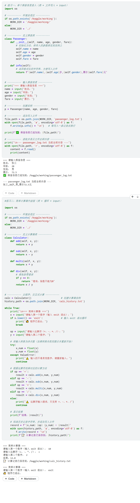

# Python DAY1 practise

> **记录时间**：2026-04-23

## 练习一：单个乘客信息录入（类 + 文件写入 + input）

**任务描述**：

1. 定义一个 `Passenger` 类，包含属性：`name`、`age`、`gender`、`fare`。
2. 类包含方法 `info()`，返回格式化的字符串（如 `"张三,28岁,男,票价72.5元"`）。
3. 通过 `input()` 让用户依次输入一位乘客的姓名、年龄、性别、票价。
4. 创建该乘客的实例，调用 `info()` 获取字符串，并将该字符串**追加写入** `passenger_log.txt` 文件（每次运行追加一条，不覆盖之前的内容）。
5. 最后读取 `passenger_log.txt` 并打印全部内容。

**参考代码框架**：

```python
import os

# 环境自适应
if os.path.exists('/kaggle/working'):
    WORK_DIR = '/kaggle/working/'
else:
    WORK_DIR = './'

class Passenger:
    def __init__(self, name, age, gender, fare):
        self.name = name
        self.age = age
        self.gender = gender
        self.fare = fare

    def info(self):
        return f"{self.name},{self.age}岁,{self.gender},票价{self.fare}元"

# 补充 input 输入、实例化、文件追加写入、读取打印
```


## 练习二：简单计算器升级版（类 + 循环 + input）

**任务描述**：

在你今天写的 `Calculator` 类基础上，增加一个交互功能：
1. 让用户通过 `input()` 输入两个数字和一个运算符（`+`、`-`、`*`、`/`）。
2. 根据运算符调用 `add`、`sub`、`multi`、`div` 方法计算结果。
3. 使用 `while` 循环，让用户可以连续计算，直到输入 `exit` 退出程序。
4. 每次计算后，将计算历史追加写入 `calc_history.txt`（格式如 `10 + 2 = 12`）。

**示例交互**：

```text
请输入第一个数字：10
请输入运算符(+,-,*,/)：+
请输入第二个数字：2
结果：12
是否继续？(输入exit退出，否则继续)
```

---

## 代码概览



---

### 练习一代码解析

| 代码片段 | 作用 | 涉及的知识点 |
|---|---|---|
| `if os.path.exists('/kaggle/working'): ...` | 自动判断运行环境，确保 Kaggle 和本地都能正确找到路径 | 环境自适应、`os` 模块 |
| `class Passenger:` | 定义一个类，封装乘客属性和行为 | 类定义 |
| `def __init__(self, name, age, gender, fare):` | 构造方法，创建实例时自动调用，用于初始化属性 | `__init__`、`self` |
| `def info(self):` | 定义一个方法，将乘客信息格式化为字符串 | 类方法、f-string |
| `input("姓名：")` | 从用户获取输入 | `input()` |
| `p = Passenger(name, age, gender, fare)` | 创建 Passenger 类的实例 | 实例化 |
| `p.info()` | 调用实例的 info 方法，获取格式化字符串 | 方法调用 |
| `with open(file_path, 'a', encoding='utf-8') as f:` | 以追加模式打开文件，`'a'` 模式不会覆盖原有内容 | 文件追加写入 |
| `f.write(p.info() + "\n")` | 将乘客信息写入文件，末尾加换行符 | 文件写入 |
| `with open(file_path, 'r', encoding='utf-8') as f:` | 以只读模式打开文件 | 文件读取 |
| `content = f.read()` | 读取文件全部内容 | 文件读取 |

### 练习一核心要点

- **追加模式 `'a'`**：每次运行脚本都会在文件末尾新增一行，不会抹掉之前的内容。这正是“日志”或“持续记录”场景的标准做法。
- **为什么在 `write` 时加 `"\n"`**？为了保证每位乘客的信息独占一行。如果不加，后续追加的内容会全部挤在同一行。
- **`Passenger` 类的设计**让数据和操作绑定在一起，符合面向对象编程的思想，也方便后续扩展更多方法（比如 `is_adult()` 判断是否成年）。

---

### 练习二代码解析

| 代码片段 | 作用 | 涉及的知识点 |
|---|---|---|
| `class Calculator:` | 定义一个计算器类，封装加减乘除功能 | 类定义、方法 |
| `def add(self, x, y):` 等 | 类的方法，返回计算结果 | 方法、返回值 |
| `calc = Calculator()` | 创建计算器类的实例 | 实例化 |
| `while True:` | 无限循环，直到用户输入 `exit` 才跳出 | `while` 循环 |
| `input("...")` | 获取用户输入 | `input()` |
| `if x.lower() == 'exit':` | 判断是否退出，`.lower()` 让判断不区分大小写 | 字符串方法、条件判断 |
| `break` | 跳出当前循环 | `break` |
| `try: ... except ValueError:` | 尝试转换数字，如果失败则捕获异常并提示重新输入 | `try/except` 错误处理 |
| `float(x)` | 将字符串转换为浮点数 | 类型转换 |
| `if op == '+': ... elif ... else:` | 根据运算符选择对应的方法 | 多分支条件判断 |
| `calc.add(x_num, y_num)` | 调用实例的 `add` 方法 | 方法调用 |
| `with open(history_path, 'a', encoding='utf-8') as f:` | 以追加模式打开文件，写入计算记录 | 文件追加写入 |
| `continue` | 跳过本次循环的剩余部分，进入下一次循环 | `continue` |

### 练习二核心要点

- **类的封装**：`Calculator` 类将计算方法打包在一起，使用时只需创建实例并调用对应方法，代码更清晰。
- **循环控制**：`while True` + `break` 让程序可以持续运行，直到用户主动退出。
- **输入验证**：`try/except` 确保了即使输入了非数字内容，程序也不会崩溃，而是给出友好提示。
- **历史记录持久化**：每次计算后立即将结果追加写入文件，方便事后查看。这里的 `'a'` 模式同样保证了历史记录不会被覆盖。